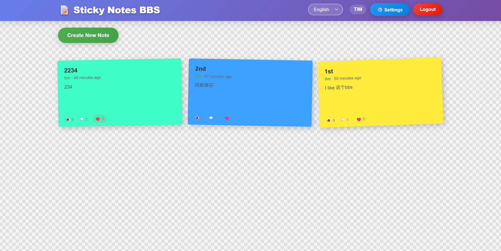

# 📝 Sticky Notes BBS

A simple, beautiful, and fully functional sticky notes-style BBS system that supports user registration/login, posting/replies, and image uploads.

## 🎯 Project Introduction

Sticky Notes BBS is a full-stack web application with a sticky notes design style, allowing users to create, browse, and reply to posts just like using sticky notes. The system has the following features:

- 🎨 Sticky notes style design, beautiful and cute
- 📱 Responsive layout, supports mobile and desktop browsers
- 🔐 User registration and login functionality
- 📝 Support for creating, browsing, and replying to posts
- 📷 Image uploads in replies
- ⚡ Fast loading, smooth experience
- 📊 Post sorting based on time decay algorithm
- 🧹 Automatic cleanup of least popular posts

## 🛠️ Technology Stack

### Backend
- **Node.js** - JavaScript runtime environment
- **Express** - Web application framework
- **PostgreSQL** - Relational database
- **Sequelize** - ORM framework
- **JWT** - User authentication
- **Multer** - File upload
- **Sharp** - Image compression

### Frontend
- **HTML5** - Page structure
- **CSS3** - Styling design
- **JavaScript (ES6+)** - Interactive logic

### Deployment
- **Docker** - Containerized deployment
- **Docker Compose** - Multi-container management
- **GitHub Actions** - CI/CD automation

## 📐 Design Approach

### 1. Architecture Design

Adopts a full-stack MVC architecture:

- **Model** - Data model layer, defines database table structures
- **View** - View layer, responsible for page display
- **Controller** - Controller layer, handles business logic and routing

### 2. Data Models

- **User** - User table, stores user information
- **Post** - Post table, stores post content
- **Reply** - Reply table, stores reply content

### 3. Core Algorithm

#### Time Decay Algorithm

Post sorting uses a time decay algorithm with the formula:

```
score = (reply_count * 2 + like_count * 3 + view_count * 0.1) * e^(-decayFactor * hours)
```

- `decayFactor` - Decay factor, default 0.01
- `hours` - Hours since post creation

This algorithm ensures that new posts and popular posts appear at the top, while older posts gradually sink over time.

### 4. Automatic Cleanup Mechanism

When the total number of posts exceeds the threshold (default 1000), the system automatically deletes the lowest-scoring posts to maintain system performance.

## ✨ Features

### User Features
- ✅ User registration
- ✅ User login
- ✅ User logout

### Post Features
- ✅ Create posts
- ✅ Browse posts
- ✅ Post details
- ✅ Delete posts
- ✅ Post likes
- ✅ Post view count

### Reply Features
- ✅ Create replies
- ✅ Reply list
- ✅ Image upload in replies
- ✅ Delete replies

### System Features
- ✅ Time decay sorting
- ✅ Automatic post cleanup
- ✅ Daily post limit
- ✅ Daily reply limit
- ✅ Image compression
- ✅ Responsive design

## 🖼️ Screenshots

### BBS Homepage


*Sticky Notes BBS homepage with colorful sticky notes layout*

## 🚀 Quick Start

### Environment Requirements

- Node.js 16.x or higher
- PostgreSQL 13.x or higher

### Installation Steps

1. **Clone Repository**

```bash
git clone https://github.com/bluewukong/OneBBS.git
cd OneBBS
```

2. **Install Dependencies**

```bash
npm install
```

3. **Configure Environment Variables**

Copy `.env.example` to `.env` and modify the configuration as needed:

```bash
cp .env.example .env
```

Configuration file explanation:

```env
# Server Configuration
PORT=3000

# Database Configuration
DB_HOST=localhost
DB_PORT=5432
DB_NAME=onebbs
DB_USER=postgres
DB_PASSWORD=password

# JWT Configuration
JWT_SECRET=your_jwt_secret_key
JWT_EXPIRES_IN=24h

# Upload Configuration
MAX_FILE_SIZE=5242880 # 5MB
UPLOAD_DIR=./uploads

# Post Configuration
MAX_POSTS_PER_DAY=10
MAX_REPLIES_PER_DAY=20
MAX_TOTAL_POSTS=1000
HOME_PAGE_POSTS=100

# Time Decay Factor
DECAY_FACTOR=0.01
```

4. **Create Database**

Create the database in PostgreSQL:

```sql
CREATE DATABASE onebbs;
```

5. **Initialize Database Schema**

Use the provided `database.sql` file to set up the database schema:

```bash
# Method 1: Using psql command line
psql -h localhost -U postgres -d onebbs -f database.sql

# Method 2: Using PostgreSQL client (like pgAdmin)
# Open the database.sql file and execute it in the onebbs database
```

The `database.sql` file will create the following tables:
- `users` - User information table
- `posts` - Post information table  
- `replies` - Reply information table
- Indexes for performance optimization

6. **Verify Database Setup**

 After running the SQL script, you can verify the tables were created:

 ```sql
 \dt onebbs;  -- List tables in onebbs database
 ```

 7. **Run the Project**

 ```bash
 # Development mode
 npm run dev

 # Production mode
 npm start
 ```

 8. **Access the Application**

Open your browser and visit: `http://localhost:3000`

## 📖 Usage Instructions

### 1. Registration and Login

1. Click the "Register" button in the top right corner
2. Fill in username, email, and password
3. Click the "Register" button to complete registration
4. Login using the registered email and password

### 2. Creating Posts

1. After logging in, click the "Create New Note" button
2. Fill in the post title and content
3. Select a note color
4. Click the "Publish" button

### 3. Browsing Posts

- The homepage displays all posts sorted by score in descending order
- Click any post to view details
- Below each post, view count, reply count, and like count are displayed

### 4. Replying to Posts

1. Go to the post details page
2. Enter content in the reply box
3. Optionally upload an image
4. Click the "Publish Reply" button

### 5. Liking Posts

Click the like button on the post details page to like a post.

## 📦 Deployment Methods

### 1. Traditional Deployment

```bash
# Install dependencies
npm install --production

# Set environment variables
export NODE_ENV=production

# Run the application
node app.js
```

### 2. Docker Deployment

#### Using Docker Compose (Recommended)

1. Ensure Docker and Docker Compose are installed
2. Modify configuration in `docker-compose.yml` (optional)
3. Run the following command:

```bash
docker-compose up -d
```

The application will run at `http://localhost:3000`.

#### Using Docker Alone

```bash
# Build the image
docker build -t onebbs .

# Run the container
docker run -d -p 3000:3000 --name onebbs onebbs
```

### 3. CI/CD Deployment

The project is configured with GitHub Actions, which automatically executes build and deployment processes when code is pushed to the main branch.

## 📁 Project Structure

```
OneBBS/
├── app.js              # Application entry file
├── package.json        # Project configuration and dependencies
├── .env                # Environment variables configuration
├── Dockerfile          # Docker build file
├── docker-compose.yml  # Docker Compose configuration
├── .github/
│   └── workflows/
│       └── main.yml    # GitHub Actions configuration
├── config/
│   └── db.js           # Database configuration
├── models/
│   ├── User.js         # User model
│   ├── Post.js         # Post model
│   └── Reply.js        # Reply model
├── routes/
│   ├── auth.js         # Authentication routes
│   ├── posts.js        # Post routes
│   └── replies.js      # Reply routes
├── middleware/
│   ├── auth.js         # Authentication middleware
│   └── cleanup.js      # Automatic cleanup middleware
├── public/
│   ├── index.html      # Main page
│   ├── style.css       # Styling file
│   └── script.js       # Frontend interaction logic
└── uploads/            # Upload file storage directory
```

## ⚙️ Configuration Guide

### Core Configuration Items

| Configuration Item | Description | Default Value |
|-------------------|-------------|---------------|
| `PORT` | Server port | 3000 |
| `DB_HOST` | Database host | localhost |
| `DB_PORT` | Database port | 5432 |
| `DB_NAME` | Database name | onebbs |
| `DB_USER` | Database username | postgres |
| `DB_PASSWORD` | Database password | password |
| `JWT_SECRET` | JWT secret key | your_jwt_secret_key |
| `MAX_POSTS_PER_DAY` | Maximum posts per day | 10 |
| `MAX_REPLIES_PER_DAY` | Maximum replies per day | 20 |
| `MAX_TOTAL_POSTS` | Maximum total posts | 1000 |
| `HOME_PAGE_POSTS` | Posts displayed on homepage | 100 |
| `DECAY_FACTOR` | Time decay factor | 0.01 |

## 🔧 Development Guide

### Development Process

1. Clone the repository
2. Install dependencies
3. Configure environment variables
4. Start the development server
5. Write code
6. Test functionality
7. Commit code

### Code Standards

- Use ES6+ syntax
- Follow RESTful API design standards
- Use 2-space indentation
- Use camelCase for variable names
- Use verb-based naming for functions

## ❓ Frequently Asked Questions

### 1. Database Connection Failed

- Check if the database service is running
- Verify database configuration is correct
- Ensure database user has sufficient permissions

### 2. Image Upload Failed

- Check upload directory permissions
- Verify file size does not exceed limits
- Ensure only image files are uploaded

### 3. Unable to Create Posts

- Check if daily post limit has been reached
- Verify form fields are completely filled
- Check network connection

### 4. Slow Page Loading

- Check server performance
- Verify database indexes
- Optimize image sizes

## 📄 License

MIT License - See [LICENSE](LICENSE) file for details

## 🤝 Contributing

Welcome to submit Issues and Pull Requests!

## 📞 Contact

If you have questions or suggestions, feel free to contact us through:

- GitHub: [bluewukong](https://github.com/bluewukong)
- Email: your-email@example.com

---

**Thank you for using Sticky Notes BBS!** 🎉

If you like this project, don't forget to give it a ⭐️!